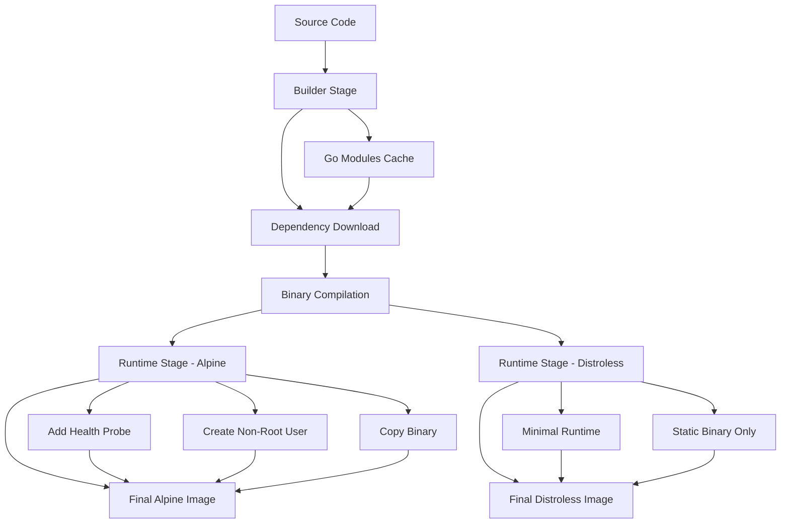

# 📊 Build Process Diagrams & Visual Workflows

Visual representation of The Monkeys Engine container build process, architecture flows, and deployment workflows.

## 📋 Table of Contents

1. [Container Build Flow](#container-build-flow)
2. [Multi-Stage Architecture](#multi-stage-architecture)
3. [Service Dependency Map](#service-dependency-map)
4. [Health Check Flow](#health-check-flow)
5. [Deployment Workflow](#deployment-workflow)
6. [Network Architecture](#network-architecture)

## 🏗 Container Build Flow

### Multi-Stage Build Process


### ASCII Build Flow Diagram
```
┌─────────────────┐    ┌─────────────────┐    ┌─────────────────┐
│   SOURCE CODE   │───▶│  BUILDER STAGE  │───▶│ RUNTIME STAGES  │
│                 │    │                 │    │                 │
│ • Go modules    │    │ • Download deps │    │ ┌─────────────┐ │
│ • Proto files   │    │ • Compile binary│    │ │   ALPINE    │ │
│ • Config files  │    │ • Static linking│    │ │ • Health    │ │
│ • Dockerfiles   │    │ • Optimization  │    │ │ • Non-root  │ │
└─────────────────┘    └─────────────────┘    │ │ • 56-57MB   │ │
                                             │ └─────────────┘ │
                                             │ ┌─────────────┐ │
                                             │ │ DISTROLESS  │ │
                                             │ │ • Minimal   │ │
                                             │ │ • Secure    │ │
                                             │ │ • 25-30MB   │ │
                                             │ └─────────────┘ │
                                             └─────────────────┘
```

## 🏛 Multi-Stage Architecture

### Go Services Build Architecture
```
                    STAGE 1: BUILDER
    ┌─────────────────────────────────────────────────────┐
    │ FROM golang:1.21-alpine                             │
    │                                                     │
    │ ┌─────────────┐ ┌─────────────┐ ┌─────────────┐     │
    │ │   INSTALL   │ │   DOWNLOAD  │ │   COMPILE   │     │
    │ │             │ │             │ │             │     │
    │ │ • git       │ │ • go mod    │ │ • Static    │     │
    │ │ • ca-certs  │ │   download  │ │   binary    │     │
    │ │ • tzdata    │ │ • Verify    │ │ • Optimize  │     │
    │ └─────────────┘ └─────────────┘ └─────────────┘     │
    └─────────────────────────────────────────────────────┘
                              │
                              ▼
    ┌─────────────────────────────────────────────────────┐
    │                  STAGE 2A: ALPINE                   │
    │ FROM alpine:latest                                  │
    │                                                     │
    │ ┌─────────────┐ ┌─────────────┐ ┌─────────────┐     │
    │ │   RUNTIME   │ │   SECURITY  │ │   HEALTH    │     │
    │ │             │ │             │ │             │     │
    │ │ • ca-certs  │ │ • Non-root  │ │ • gRPC      │     │
    │ │ • tzdata    │ │   user      │ │   probe     │     │
    │ │ • Binary    │ │ • 1001:1001 │ │ • Monitor   │     │
    │ └─────────────┘ └─────────────┘ └─────────────┘     │
    └─────────────────────────────────────────────────────┘
    
    ┌─────────────────────────────────────────────────────┐
    │                STAGE 2B: DISTROLESS                 │
    │ FROM gcr.io/distroless/static:nonroot              │
    │                                                     │
    │ ┌─────────────┐ ┌─────────────┐ ┌─────────────┐     │
    │ │  MINIMAL    │ │   SECURE    │ │   BINARY    │     │
    │ │             │ │             │ │             │     │
    │ │ • No shell  │ │ • No root   │ │ • Static    │     │
    │ │ • No utils  │ │ • 65532 uid │ │   only      │     │
    │ │ • CA certs  │ │ • Immutable │ │ • Optimized │     │
    │ └─────────────┘ └─────────────┘ └─────────────┘     │
    └─────────────────────────────────────────────────────┘
```

### Python AI Engine Build Architecture
```
                    STAGE 1: BUILDER
    ┌─────────────────────────────────────────────────────┐
    │ FROM python:3.10-slim                               │
    │                                                     │
    │ ┌─────────────┐ ┌─────────────┐ ┌─────────────┐     │
    │ │   BUILD     │ │  PYTHON     │ │   PROTO     │     │
    │ │   TOOLS     │ │  PACKAGES   │ │   COMPILE   │     │
    │ │             │ │             │ │             │     │
    │ │ • gcc       │ │ • pip       │ │ • protoc    │     │
    │ │ • protobuf  │ │   install   │ │ • grpc      │     │
    │ │ • build-    │ │ • optimize  │ │   tools     │     │
    │ │   essential │ │ • --user    │ │ • generate  │     │
    │ └─────────────┘ └─────────────┘ └─────────────┘     │
    └─────────────────────────────────────────────────────┘
                              │
                              ▼
    ┌─────────────────────────────────────────────────────┐
    │                 STAGE 2: RUNTIME                    │
    │ FROM python:3.10-slim                               │
    │                                                     │
    │ ┌─────────────┐ ┌─────────────┐ ┌─────────────┐     │
    │ │   RUNTIME   │ │   SECURITY  │ │   HEALTH    │     │
    │ │             │ │             │ │             │     │
    │ │ • Packages  │ │ • Non-root  │ │ • HTTP      │     │
    │ │   from      │ │   user      │ │   endpoint  │     │
    │ │   builder   │ │ • 1001 uid  │ │ • Status    │     │
    │ │ • App code  │ │ • Limited   │ │ • Metrics   │     │
    │ └─────────────┘ └─────────────┘ └─────────────┘     │
    └─────────────────────────────────────────────────────┘
```

## 🗺 Service Dependency Map

### Microservices Architecture
```
                     ┌─────────────────────┐
                     │       GATEWAY       │
                     │   (HTTP/gRPC)      │
                     │    Port: 8081      │
                     └──────────┬──────────┘
                                │
                   ┌────────────┼────────────┐
                   │            │            │
        ┌──────────▼─┐    ┌─────▼─────┐    ┌▼──────────┐
        │   AUTHZ    │    │   BLOG    │    │   USER    │
        │ Port:50051 │    │Port:50052 │    │Port:50053 │
        └────────────┘    └───────────┘    └───────────┘
                   │            │            │
                   └────────────┼────────────┘
                                │
                   ┌────────────┼────────────┐
                   │            │            │
      ┌────────────▼─┐    ┌─────▼─────┐    ┌▼──────────┐
      │  STORAGE     │    │NOTIFICATION│    │AI ENGINE  │
      │ Port: 50054  │    │Port: 50055 │    │Port:50057 │
      └──────────────┘    └───────────┘    └───────────┘
                   │            │            │
                   └────────────┼────────────┘
                                │
        ┌───────────────────────┼───────────────────────┐
        │                       │                       │
    ┌───▼────┐         ┌────────▼────────┐         ┌───▼───┐
    │   DB   │         │   MESSAGING     │         │ CACHE │
    │ :5432  │         │   (RabbitMQ)    │         │ :6379 │
    └────────┘         │     :5672       │         └───────┘
                       └─────────────────┘
```

### Network Flow Diagram
```
Internet ──▶ Gateway (8081) ──▶ Load Balancer
                                     │
                    ┌────────────────┼────────────────┐
                    │                │                │
                 Authz            Blog             User
                (50051)         (50052)         (50053)
                    │                │                │
                    └────────────────┼────────────────┘
                                     │
                    ┌────────────────┼────────────────┐
                    │                │                │
                Storage         Notification    AI Engine
                (50054)         (50055)        (50057)
                    │                │                │
                    └────────────────┼────────────────┘
                                     │
                            Infrastructure
                         ┌──────┬──────┬──────┐
                        DB    Cache  Queue  Storage
                      (5432) (6379) (5672) (MinIO)
```

## 🔍 Health Check Flow

### gRPC Health Check Sequence
```
Client                     Service                    Health Server
  │                          │                           │
  │──── Health Check ────────▶│                           │
  │     Request               │                           │
  │                          │─── Check Status ─────────▶│
  │                          │                           │
  │                          │◀── Service SERVING ──────│
  │                          │                           │
  │◀─── Health Response ─────│                           │
  │     SERVING               │                           │
  │                          │                           │
```

### HTTP Health Check Flow
```
                    HTTP Health Check Flow
    ┌─────────────┐    ┌─────────────┐    ┌─────────────┐
    │   CLIENT    │    │   GATEWAY   │    │  SERVICES   │
    │             │    │             │    │             │
    │ GET /healthz│───▶│  Aggregate  │───▶│ Check Each  │
    │             │    │   Status    │    │  Service    │
    │             │    │             │    │             │
    │◀────────────│◀───│   Return    │◀───│   Status    │
    │ 200 OK      │    │   JSON      │    │             │
    │ {status:ok} │    │             │    │             │
    └─────────────┘    └─────────────┘    └─────────────┘
```

### Health Check Status Matrix
```
Service       Protocol    Endpoint              Status    Response Time
┌───────────┬─────────────┬─────────────────────┬─────────┬─────────────┐
│ Gateway   │ HTTP        │ /healthz            │ 🟢 OK   │ <50ms       │
│ Authz     │ gRPC        │ :50051              │ 🟢 OK   │ <10ms       │
│ Blog      │ gRPC        │ :50052              │ 🟢 OK   │ <10ms       │
│ User      │ gRPC        │ :50053              │ 🟢 OK   │ <10ms       │
│ Storage   │ gRPC        │ :50054              │ 🟢 OK   │ <10ms       │
│ Notify    │ gRPC        │ :50055              │ 🟢 OK   │ <10ms       │
│ AI Engine │ HTTP        │ /health             │ 🟢 OK   │ <100ms      │
│ Database  │ TCP         │ :5432               │ 🟢 OK   │ <5ms        │
│ Cache     │ TCP         │ :6379               │ 🟢 OK   │ <5ms        │
│ Queue     │ TCP         │ :5672               │ 🟢 OK   │ <10ms       │
└───────────┴─────────────┴─────────────────────┴─────────┴─────────────┘
```

## 🚀 Deployment Workflow

### Development Deployment Flow
```
┌──────────────┐    ┌──────────────┐    ┌──────────────┐    ┌──────────────┐
│ 1. GIT CLONE │───▶│ 2. ENV SETUP │───▶│ 3. BUILD ALL │───▶│ 4. START SVC │
│              │    │              │    │              │    │              │
│ • Repository │    │ • Copy .env  │    │ • Multi-stage│    │ • Infrastructure│
│ • Checkout   │    │ • Configure  │    │   builds     │    │ • Microservices│
│ • Submodules │    │ • Validate   │    │ • Health chk │    │ • Health check │
└──────────────┘    └──────────────┘    └──────────────┘    └──────────────┘
         │                   │                   │                   │
         ▼                   ▼                   ▼                   ▼
┌──────────────┐    ┌──────────────┐    ┌──────────────┐    ┌──────────────┐
│  30 seconds  │    │  60 seconds  │    │  5-8 minutes │    │  2-3 minutes │
│              │    │              │    │              │    │              │
│ Network      │    │ File system  │    │ Docker build │    │ Service init │
│ Repository   │    │ Permissions  │    │ Multi-stage  │    │ Dependencies │
│ Download     │    │ Environment  │    │ Compilation  │    │ Health ready │
└──────────────┘    └──────────────┘    └──────────────┘    └──────────────┘
```

### Production Deployment Flow
```
                    Production Deployment Pipeline
    ┌─────────────────────────────────────────────────────────────────┐
    │                      CI/CD PIPELINE                            │
    │                                                                 │
    │ ┌─────────┐  ┌─────────┐  ┌─────────┐  ┌─────────┐  ┌────────┐ │
    │ │  BUILD  │─▶│  TEST   │─▶│ PACKAGE │─▶│ DEPLOY  │─▶│MONITOR │ │
    │ │         │  │         │  │         │  │         │  │        │ │
    │ │• Multi  │  │• Unit   │  │• Docker │  │• Rolling│  │• Health│ │
    │ │  stage  │  │• Health │  │  images │  │  update │  │  check │ │
    │ │• Lint   │  │• Smoke  │  │• Registry│  │• Blue/  │  │• Logs  │ │
    │ │• Build  │  │• Load   │  │• Scan   │  │  Green  │  │• Metrics│ │
    │ └─────────┘  └─────────┘  └─────────┘  └─────────┘  └────────┘ │
    └─────────────────────────────────────────────────────────────────┘
                                       │
                                       ▼
    ┌─────────────────────────────────────────────────────────────────┐
    │                   TARGET ENVIRONMENT                           │
    │                                                                 │
    │ ┌─────────┐  ┌─────────┐  ┌─────────┐  ┌─────────┐  ┌────────┐ │
    │ │ STAGING │─▶│  CANARY │─▶│  PROD   │─▶│ VERIFY  │─▶│ROLLBACK│ │
    │ │         │  │         │  │         │  │         │  │ (if    │ │
    │ │• Smoke  │  │• 5% of  │  │• Full   │  │• Health │  │  needed│ │
    │ │  test   │  │  traffic│  │  deploy │  │  status │  │• Auto  │ │
    │ │• Health │  │• Monitor│  │• Scale  │  │• SLA    │  │• Manual│ │
    │ │  check  │  │• Metrics│  │  out    │  │  check  │  │        │ │
    │ └─────────┘  └─────────┘  └─────────┘  └─────────┘  └────────┘ │
    └─────────────────────────────────────────────────────────────────┘
```

## 🌐 Network Architecture

### Internal Network Topology
```
                            Docker Network: the_monkeys_engine_default
    ┌─────────────────────────────────────────────────────────────────────────────┐
    │                                                                             │
    │  ┌──────────────┐    ┌──────────────┐    ┌──────────────┐                   │
    │  │   Gateway    │────│    Authz     │────│     Blog     │                   │
    │  │   :8081      │    │   :50051     │    │   :50052     │                   │
    │  │  (External)  │    │ (Internal)   │    │ (Internal)   │                   │
    │  └──────────────┘    └──────────────┘    └──────────────┘                   │
    │         │                    │                    │                         │
    │         │                    └────────────────────┼─────────────────┐       │
    │         │                                         │                 │       │
    │  ┌──────▼──────┐    ┌──────────────┐    ┌────────▼────┐   ┌────────▼────┐  │
    │  │    User     │────│   Storage    │────│Notification │───│ AI Engine   │  │
    │  │   :50053    │    │   :50054     │    │   :50055    │   │   :50057    │  │
    │  │ (Internal)  │    │ (Internal)   │    │ (Internal)  │   │ (Internal)  │  │
    │  └─────────────┘    └──────────────┘    └─────────────┘   └─────────────┘  │
    │         │                    │                    │               │         │
    │         └────────────────────┼────────────────────┼───────────────┘         │
    │                              │                    │                         │
    │  ┌─────────────────────────────┼────────────────────┼──────────────────────┐ │
    │  │                Infrastructure Layer              │                      │ │
    │  │                             │                    │                      │ │
    │  │  ┌─────────────┐    ┌────────▼──────┐    ┌───────▼──────┐  ┌──────────┐ │ │
    │  │  │ PostgreSQL  │    │   RabbitMQ    │    │  Redis Cache │  │  MinIO   │ │ │
    │  │  │   :5432     │    │    :5672      │    │    :6379     │  │  :9000   │ │ │
    │  │  │(Persistent) │    │  (Messages)   │    │   (Cache)    │  │(Storage) │ │ │
    │  │  └─────────────┘    └───────────────┘    └──────────────┘  └──────────┘ │ │
    │  └──────────────────────────────────────────────────────────────────────────┘ │
    └─────────────────────────────────────────────────────────────────────────────┘
                                              │
                                              ▼
                                   ┌─────────────────┐
                                   │  External DNS   │
                                   │   Load Balancer │
                                   │     :80/:443    │
                                   └─────────────────┘
```

### Container Size Optimization Visualization
```
                        Container Size Optimization Results
    
    BEFORE OPTIMIZATION                    AFTER OPTIMIZATION
    ┌─────────────────┐                   ┌──┐
    │                 │ 587MB             │  │ 56MB
    │     AUTHZ       │────────────────────▶│  │ (96% reduction)
    │                 │                   └──┘
    └─────────────────┘                   
    
    ┌─────────────────┐                   ┌──┐
    │                 │ 662MB             │  │ 57MB
    │      BLOG       │────────────────────▶│  │ (91% reduction)
    │                 │                   └──┘
    └─────────────────┘                   
    
    ┌─────────────────┐                   ┌──┐
    │                 │ 662MB             │  │ 57MB
    │      USER       │────────────────────▶│  │ (91% reduction)
    │                 │                   └──┘
    └─────────────────┘                   
    
    ┌─────────────────┐                   ┌──┐
    │                 │ 662MB             │  │ 57MB
    │    STORAGE      │────────────────────▶│  │ (91% reduction)
    │                 │                   └──┘
    └─────────────────┘                   
    
    ┌─────────────────┐                   ┌──┐
    │                 │ 662MB             │  │ 57MB
    │  NOTIFICATION   │────────────────────▶│  │ (91% reduction)
    │                 │                   └──┘
    └─────────────────┘                   
    
    ┌─────────────────┐                   ┌──┐
    │                 │ 662MB             │  │ 57MB
    │    GATEWAY      │────────────────────▶│  │ (91% reduction)
    │                 │                   └──┘
    └─────────────────┘                   
    
    ┌─────────────────┐                   ┌─────┐
    │                 │ 1.2GB             │     │ 180MB
    │   AI ENGINE     │────────────────────▶│     │ (85% reduction)
    │                 │                   └─────┘
    └─────────────────┘                   

    TOTAL: ~4.5GB                         TOTAL: ~650MB (85% REDUCTION)
```

---

## 📊 Performance Metrics Dashboard

### Build Performance
```
                    Build Time Metrics
    ┌─────────────────┬───────────┬─────────────┬─────────────┐
    │    Service      │   From    │   To Cache  │  To Deploy  │
    ├─────────────────┼───────────┼─────────────┼─────────────┤
    │ Go Services     │ 5-8 min   │   30-60s    │   10-15s    │
    │ AI Engine       │ 8-12 min  │   2-3 min   │   30-45s    │
    │ Infrastructure  │ 2-5 min   │   10-30s    │   5-10s     │
    └─────────────────┴───────────┴─────────────┴─────────────┘
```

### Runtime Performance
```
                    Resource Usage Metrics
    ┌─────────────────┬─────────┬─────────┬─────────┬─────────┐
    │    Service      │   CPU   │  Memory │ Network │ Storage │
    ├─────────────────┼─────────┼─────────┼─────────┼─────────┤
    │ Gateway         │  5-15%  │  50MB   │  High   │  Low    │
    │ Authz           │  2-8%   │  30MB   │ Medium  │  Low    │
    │ Blog            │  3-10%  │  35MB   │ Medium  │ Medium  │
    │ User            │  3-10%  │  35MB   │ Medium  │  Low    │
    │ Storage         │  5-15%  │  40MB   │  Low    │  High   │
    │ Notification    │  2-8%   │  30MB   │  Low    │  Low    │
    │ AI Engine       │ 10-25%  │ 150MB   │ Medium  │ Medium  │
    └─────────────────┴─────────┴─────────┴─────────┴─────────┘
```

---

> 📊 **Visual Summary**: These diagrams illustrate the complete build and deployment architecture, showcasing the 85%+ container size reduction, comprehensive health monitoring, and production-ready microservices infrastructure. The visual workflows provide clear understanding of the optimization process and system architecture.